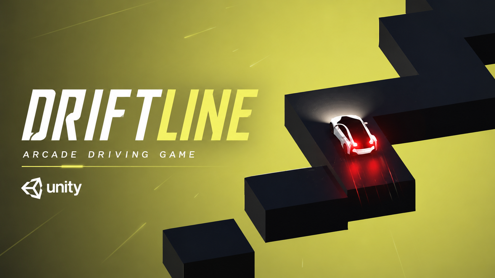

# Driftline

  

A Unity arcade driving game featuring procedural platform generation and tap-based direction switching.

## Gameplay

  

---

## Overview

Driftline is a fast-paced arcade driving prototype developed in Unity.

The project focuses on responsive player controls, procedural platform generation, score progression, and simple but engaging gameplay loops.

Players must time their inputs carefully to stay on the path and achieve the highest score possible.

---

## Technical Details

| Category    | Details          |
| ----------- | ---------------- |
| Engine      | Unity            |
| Genre       | Arcade           |
| Perspective | Top-Down         |
| Platform    | Mobile Prototype |
| Role        | Solo Developer   |

---

## Features

- Tap-Based Direction Switching
- Procedural Platform Generation
- Dynamic Platform Destruction
- Score System
- Endless Gameplay Loop
- Randomized Visual Presentation

---

## Code Highlights

### Procedural Generation

Platforms are generated dynamically during gameplay to create an endless driving experience.

### Platform Lifecycle

Previously crossed platforms are removed after a delay, helping maintain performance and keeping the gameplay area clean.

### Score Tracking

The score system updates continuously as the player progresses through generated platforms.

### Gameplay Loop

Designed around a simple but effective risk-and-reward loop focused on timing and precision.

---

## Responsibilities

As the sole developer of the project, I was responsible for:

- Gameplay Programming
- Player Controller Implementation
- Procedural Generation Systems
- Score System Development
- UI Development
- Game Flow Management
- Testing & Debugging

---

## Key Learnings

- Unity Gameplay Programming
- Procedural Content Generation
- Game Loop Design
- Player Input Handling
- Performance Considerations
- Rapid Prototyping Workflows

---

## Developer

Abdulmajeed Alshammari

Gameplay Programmer
